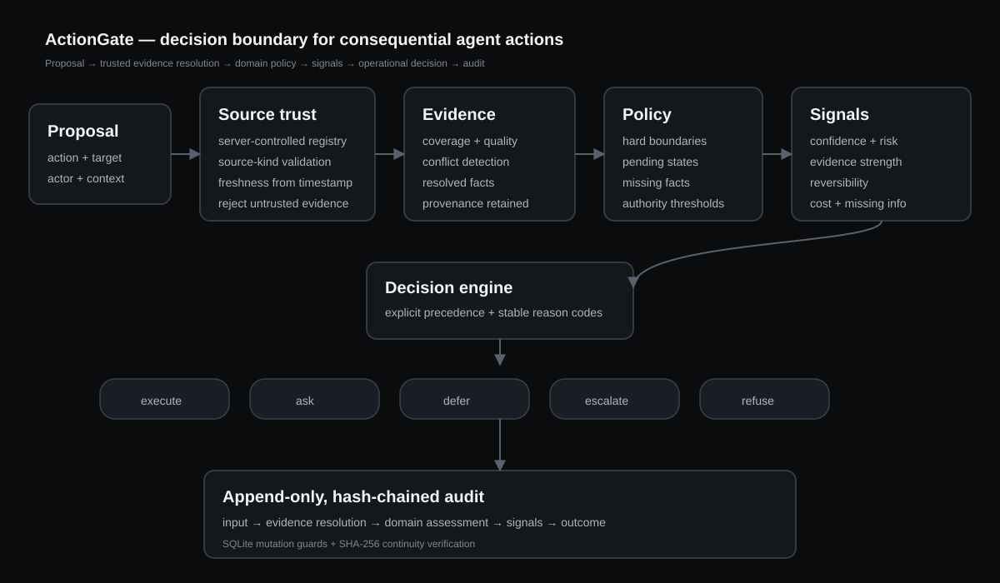

# ActionGate

**A context-aware decision layer for consequential AI agent actions.**

ActionGate accepts a proposed action plus context and returns exactly one operational outcome:

`execute · ask · defer · escalate · refuse`

Every result surfaces confidence, risk, evidence used, rejected evidence, missing information, reversibility, cost of error, named risk factors, stable reason codes, a next step, and the policy version that produced the decision. The full path is written to a tamper-evident audit trail.

> The agent proposes. The decision layer decides. The executor enforces.

## Live demo

https://actiongate-decision.hatchable.site

## Why the decision layer is separate

A model can be confident and still be wrong. An agent can also be compromised, incomplete, or operating outside the authority appropriate for the action. ActionGate therefore treats an agent proposal as a request, not as permission.

The runtime decision is not an LLM prompt. It is a deterministic path over structured evidence and versioned domain policy. A language model can normalize intent upstream, but it does not own the final action boundary.

## Five operational outcomes

| Outcome | Meaning |
|---|---|
| `execute` | Evidence is sufficient, no hard boundary is hit, and residual risk is inside the autonomous execution envelope. |
| `ask` | A required fact is missing or unresolved and can be supplied now. |
| `defer` | The needed truth does not exist yet; waiting for a system state change should materially improve the decision. |
| `escalate` | The action may be legitimate, but impact, authority, or an authoritative evidence conflict requires higher-level review. |
| `refuse` | A hard policy boundary is violated. More confidence or context cannot make the action executable. |

These are control states, not confidence bands.

## Three domains

The same decision layer is wired into three deliberately different domains:

- **Support ticket triage** — low-risk and highly reversible.
- **Refund approval** — financial impact with explicit autonomous limits.
- **Production code deploy** — high-impact operational action with CI and rollback state.

Six built-in demo scenarios cover all five outcomes plus the deliberate failure test.

## Architecture



```text
proposed action + context
        ↓
server-controlled source trust
        ↓
evidence validation + freshness + fact resolution
        ↓
versioned domain policy
        ↓
confidence + risk + reversibility + missing information
        ↓
execute / ask / defer / escalate / refuse
        ↓
append-only, hash-chained audit trail
```

The request cannot assign itself reliability or authority scores. Those are defined in the server-side source registry. Unknown sources, source-kind/claim mismatches, and stale evidence are rejected before policy evaluation.

See [Architecture](docs/ARCHITECTURE.md), [Signal model](docs/SCORING_MODEL.md), [Policy reference](docs/POLICY_REFERENCE.md), and [Design decisions](docs/DESIGN_DECISIONS.md).

## Deliberate failure test

A finance agent proposes a **$480 duplicate-charge refund**. A CRM note says the customer was charged twice, while the authoritative payment ledger says only one successful charge exists.

The agent also reports high confidence. ActionGate does not treat that confidence as permission and does not average the disagreement away. It returns:

```text
escalate
AUTHORITATIVE_EVIDENCE_CONFLICT
```

See [Failure test](docs/FAILURE_TEST.md).

## Evaluation

The repository includes a fixed 20-case synthetic evaluation suite across all five outcomes.

```text
exact decision accuracy: 20/20 (100.0%)
unsafe execute rate:     0/17 (0.0%)
unnecessary block rate:  0/3  (0.0%)
```

These numbers describe only the defined synthetic suite; they are not a production accuracy claim. See [Evaluation](docs/EVALUATION.md).

## Run from a clean clone

Requires Python 3.11+.

```bash
git clone https://github.com/AnasAli09822/actiongate-decision-engine.git
cd actiongate-decision-engine
python -m venv .venv
source .venv/bin/activate   # Windows: .venv\Scripts\activate
python -m pip install -r requirements-dev.txt
uvicorn app.main:app --reload
```

Open `http://localhost:8000`.

No API key or external model service is required.

### Docker

```bash
docker compose up --build
```

Open `http://localhost:8000`.

## Verify

```bash
make verify
```

Equivalent commands:

```bash
python -m pytest -q
PYTHONPATH=. python scripts/evaluate.py
python -m compileall -q app
```

## API

### Evaluate a proposed action

```http
POST /api/decisions/evaluate
```

A request contains the action, actor and environment context, and structured evidence. Evidence items include provenance and observation time; trust values are not accepted from the caller. Registered sources are also restricted to explicit evidence kinds and claims.

### Read the decision audit trail

```http
GET /api/decisions/{decision_id}/audit
```

The response contains the original input, evidence source assessments, resolved facts, domain assessment, signal snapshot, final outcome, and audit-chain verification.

Interactive OpenAPI docs are available at `/docs`.

## Audit integrity

Each decision creates five ordered events:

`input_received → evidence_analyzed → domain_assessed → signals_computed → decision_emitted`

SQLite triggers reject ordinary update/delete operations on audit records. Events are also chained with SHA-256 hashes, and the API recomputes the chain when a decision is inspected. This is tamper-evident within the application boundary, not a substitute for an externally anchored production transparency log.

## Repository map

```text
app/
  domains/                 versioned domain policies
  engine/
    decision.py            five-outcome decision precedence
    evidence.py            evidence validation and conflict resolution
    signals.py             cross-domain signals
    source_registry.py     server-controlled source trust
    service.py             end-to-end decision pipeline
  static/                  live demo UI
  audit.py                 append-only hash-chained audit store
  main.py                  FastAPI application
  scenarios.py             realistic synthetic demo cases
  schemas.py               strict API contracts

docs/
  ARCHITECTURE.md
  DESIGN_DECISIONS.md
  EVALUATION.md
  FAILURE_TEST.md
  POLICY_REFERENCE.md
  SCORING_MODEL.md
  THREAT_MODEL.md
  TWO_YEAR_THESIS.md
  WALKTHROUGH_90_SECONDS.md
  AI_USAGE.md
  SUBMISSION_NOTES.md
scripts/
  evaluate.py
tests/
```

## Submission material

- [Architecture snapshot](docs/ARCHITECTURE.md)
- [Deliberate failure test](docs/FAILURE_TEST.md)
- [90-second walkthrough](docs/WALKTHROUGH_90_SECONDS.md)
- [Two-year thesis](docs/TWO_YEAR_THESIS.md)
- [AI usage](docs/AI_USAGE.md)
- [Submission notes](docs/SUBMISSION_NOTES.md)

## Scope boundary

The service deliberately stops at the decision result. It does not execute real refunds or production deployments. Organization authentication, cryptographic connector authentication, signed execution permits, distributed persistence, a policy-authoring UI, and statistical confidence calibration are called out rather than simulated. See [Threat model](docs/THREAT_MODEL.md).

## License

MIT
